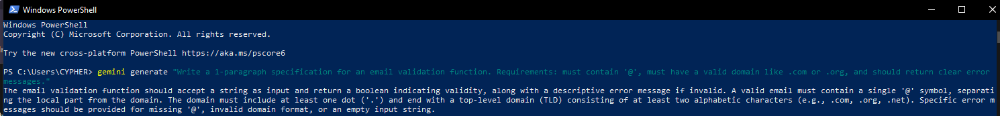

# AIDD 30-Day Challenge — Task 2

## Part A — Theory (Short Questions)

### 1. Nine Pillars Understanding

**Q1: Why using AI agents for repetitive setup tasks helps me grow as a system architect:**  
**A1:** AI agents handle repetitive setup tasks like folders, configurations, and tests. This saves time and lets me focus on system design, architecture, and planning. I stop being a typist and start thinking like an architect.

**Q2: How the Nine Pillars help me become an M-Shaped Developer:**  
**A2:** The Nine Pillars act like a supportive team. I can focus deeply on 2–4 areas I like while AI handles other tasks, helping me grow multiple skills instead of just one.

---

### 2. Vibe Coding vs Specification-Driven Development

**Q1: Why does Vibe Coding usually create problems after one week?**  
**A1:** Vibe Coding relies on intuition and quick coding without clear specifications. This leads to messy, hard-to-extend architecture, unclear logic, and accumulating bugs.

**Q2: How would Specification-Driven Development prevent those problems?**  
**A2:** Specification-Driven Development defines clear requirements before coding. This makes the system organized, maintainable, and scalable, reducing bugs and architectural issues.

---

### 3. Architecture Thinking

**Q1: How does architecture-first thinking change the role of a developer in AIDD?**  
**A1:** Developers move from typing line-by-line code to planning, designing, and guiding AI. They focus on reviewing outputs, making strategic decisions, and ensuring the system works at scale.

**Q2: Why must developers think in layers and systems instead of raw code?**  
**A2:** Thinking in layers ensures software is organized, scalable, and maintainable. Raw code focus creates messy projects that are hard to extend.

---

## Part B — Practical Task (Screenshot Required)

### 1️ CLI Prompt

## 

### 2️⃣ AI-Generated Specification

The email validation function should ensure the input string contains exactly one "@" separating the local part and the domain, and that the domain ends with a valid extension such as .com or .org. It must detect missing "@", invalid domain formats, or unsupported structures. Clear error messages should be returned, like "Missing @ symbol," "Invalid domain format," or "Email must end with a valid extension." Success is returned only when all criteria are met.

---

## Part C — Multiple Choice Questions

1. What is the main purpose of Spec-Driven Development?  
   **B** Clear requirements before coding begins

2. What is the biggest mindset shift in AI-Driven Development?  
   **B** Thinking in systems and clear instructions

3. Biggest failure of Vibe Coding?  
   **B** Architecture becomes hard to extend

4. Main advantage of using AI CLI agents (like Gemini CLI)?  
   **B** Handle repetitive tasks so dev focuses on design & problem-solving

5. What defines an M-Shaped Developer?  
   **C** Deep skills in multiple related domains

---

## Reflection

The AI era is changing everything about being a developer. With Nine Pillars, Spec-Driven Development, and AI agents, coding is no longer just typing—it’s about planning, thinking, and designing systems. Architecture-first thinking lets me see the bigger picture, while AI handles repetitive work.

My role has shifted from a traditional coder to a system-level thinker. I focus on requirements, edge cases, and strategy, while AI executes detailed tasks. This allows me to build scalable, maintainable systems and grow into an M-Shaped developer with deep expertise in multiple areas.

Working with AI is not replacement—it’s evolution. Thinking in systems, writing clear specifications, and orchestrating AI agents enables me to achieve more in less time and solve meaningful problems.
