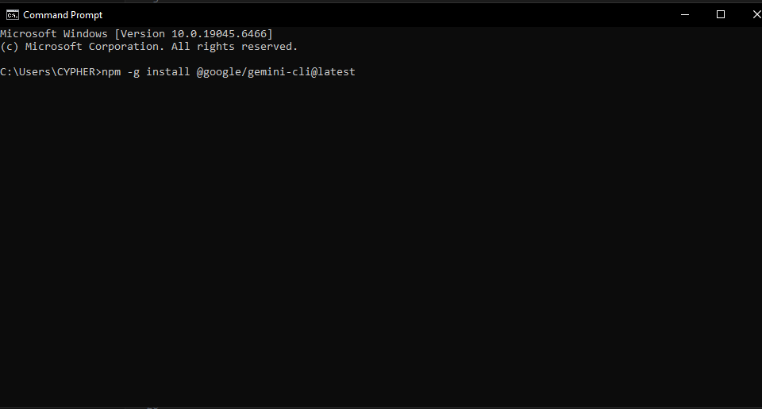
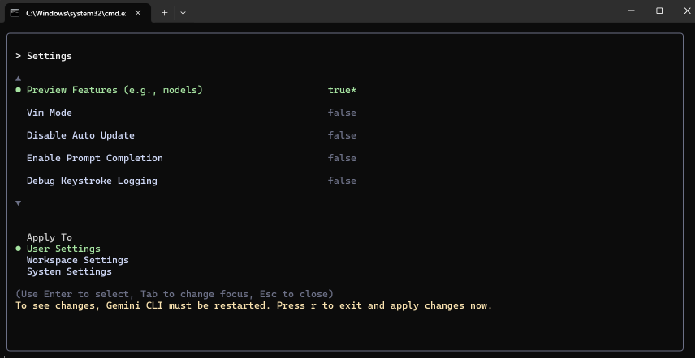

# AIDD 30-Day Challenge — Task 3

### PART A — Research Questions

#### 1. What new improvements were introduced in Gemini 3.0?  
Gemini 3.0 is faster, more stable, and overall better at understanding long and complex inputs. It also gives more accurate answers and handles multimodal tasks more smoothly than the older version.

#### 2. How does Gemini 3.0 improve coding and automation workflows?  
It writes cleaner code, catches mistakes more reliably, and supports longer context windows, which helps in debugging and automating repetitive development tasks.

#### 3. How does Gemini 3.0 improve multimodal understanding?  
The model can understand and connect text, images, and other formats with better accuracy. Its explanations and outputs feel more natural and closer to real human reasoning.

#### 4. Name any two developer tools introduced with Gemini 3.0.  
- Gemini Code Assist  
- Updated Gemini API for developers  

---

### PART B — Practical Task

I used the Gemini CLI to update the model to **Gemini 3.0**.  
Below is the screenshot placeholder.

> **Screenshot:**  


---

### Commands I used

```bash
gemini models list
